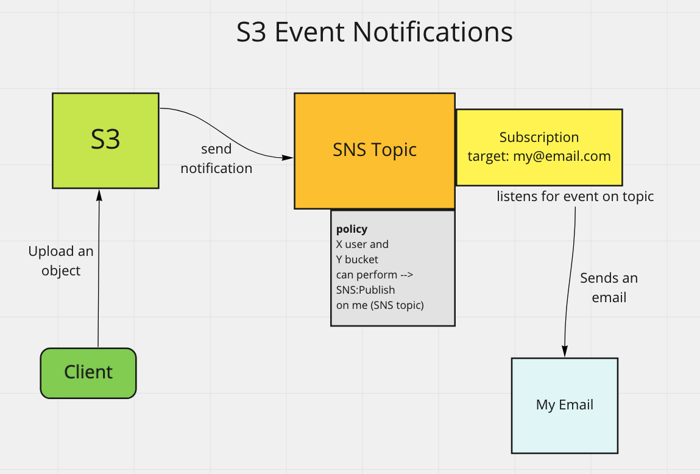

# Amazon Simple Storage Service - S3

An object based storage service

#### High Level
- You provision an S3 bucket
- a bucket stores objects - or files
- the bucket and files are accessible over the HTTP protocol
- bucket name and file name included in the URL
- Scalable - can store limitless quantities of data

#### Bucket
- bucket name must be globally unique
- buckets are created within a region
- create bucket in region that is closest to your users
  - lower latency
- cannot create bucket within a bucket

#### Objects
- the files stored in buckets
- can store any file type
  - pdf
  - mp4 (movie)
  - jpg
  - word document
  - can be from 0 bytes to 5 TB
- objects contains
  - key - name of object / file
  - value - data
  - version id
  - meta data
  - subresources
  - access control information

#### Folders
- No hierarchy for objects in a bucket
- all objects stored at the same level
- can mimic a hierarchy through creating "folders"
- folders are actually stored as part of the object name
- folders are shared prefixes for associating objects
- folders show in AWS console
- folders can be created within folders


strong read-after-write consistency

---

## Access S3
- via the url
- S3 not associated with VPC
- S3 referred to as a public resource

#### Access S3 publicly from VPC
- using Internet Gateway

#### Access S3 privately from VPC
- using S3 Gateway Endpoint
- creates a private channel
- avoids the internet

---

## S3 Storage Classes

Different S3 storage classes have different price points

[see table in slides]

## Different Classes

Standard-IA
- for infrequent access

Once Zone-IA
- infrequent access
- stored in one AZ

Galcier
- archiving data
- hold data for long time
- cheaper than others

---

## Different Metrics

Durability
- liklihood of object being lost

Availability
- degree of high availability

**Minimum storage duration charge**
- minimum amount of time to store object before moving it to another storage class or bucket

Retrieval Fee
- standard or intelligent tiering is free to retrieval

first byte latency
- most set to milliseconds
- s3 glacier options for minutes or hours
- s3 galcier deep archive - hours
  - up to 24 hours

---

## Exercise - Create Amazon S3 Bucket

In S3 console
- notice S3 scope is global
- even though bucket is stored in a region

Create a bucket
- choose region close to your users
- leave public access blocked
  - blocked by default

upload a couple objects to bucket

explore properties dropdown for bucket
- leave standard selected

explore permissions tab
- for bucket
- for individual object

---

## IAM Policies, Bucket Policies, and ACLs

### Review

IAM policies are identity-based policies
- attached to a user, group, or role
- written in JSON
- leaves out the principal element in the policy
  - policy is assumed to a principal through role or assignment

Resource based policies are attached to the resource

Access is denied by default
- requires an explicit allow

---

## Bucket Policy

- Bucket policies are resource based policies
- attached to S3 bucket
- use same access policy language
- includes the principal
  - specifies principal whom policy applies to

---

## S3 Access Control Lists (S3 ACLs)

- legacy mechanism
- recommended to use bucket policy or IAM policy
  - not as powerful
- can be attached to bucket or object

---

## Policy Type Use Cases

#### IAM Policy
- best when
  - need to control services other than S3
  - many buckets with different permissions
    - keep all policies centrally located

#### S3 Bucket Policy
- best when
  - want to grant cross-account access to S3
  - IAM policy reaching size limit

---

## Exercise - Access Control Lists (ACLs)

Attempt to access an object in your bucket
- notice the access denied message

Under bucket permissions
- unblock public access

View the edit Access Control List options
- notice not as powerful as a policy

Click on object and edit access control list
- grant Read privilages for everyone

From bucket console
- select other object > action > make public

### Cross Account Access

Can allow other AWS accounts to access bucket or object

Clean Up
- block public access for bucket and objects

---

## Exercise - Bucket and User Policy Practice

Setup
- create another user account
- not in any groups
- log in to user account in a private / incognito window

Currently userB doesn't have any access to S3 or otherwise

In main account create 2 folder in S3 console
- Department
- Confidential

Upload a file in each folder

Open provided json file - `user-policies-and-bucket-policies.json`

Grant list bucket to user
- Copy #1 - list bucket (user policy)
- add inline policy to userB

go to userB window
- notice userB can see bucket list
- userB cannot see contents of bucket

---

Update userB to policy #2
- allows user
  - list all buckets
  - to see contents of specified bucket
  - update bucket arn in policy

In userB window
- Can now list contents of one bucket
- cannot list items in confidential
- cannot download objects in a bucket

---

Update userB to policy #3
- allows
  - viewing contents of bucket
  - view contents of Department folder

---

Update userB to policy #4
- same privileges as before
- allows for GetObject and UpObject actions in Department folder

UserB
- can download and upload to Department folder

---

Update userB to policy #2


policy #5 is an S3 bucket policy
- Update user ARN in policy #5
- add policy to bucket

User has full permissions to confidential folder

---

## S3 Versioning, Replication and Lifecycle Rules

### S3 Versioning

- keeping multiple versions of object in same bucket
- benefits
  - can recover objects from
    - accidental deletion
    - overwrite

---

### Replication

#### Cross-Region Replication
- setting up 2 buckets in 2 separate regions
- uploading or making change to 1 bucket will automatically update other bucket

#### Same-Region Replication
- automatic bucket replication within the same region

#### For both
- Can set up bucket replication across different accounts
- Required versioning to be enabled


---

### S3 Lifecycle Management

#### Transition Actions
- can define when object transitions to another storage class

#### Expiration Action
- can define when an object expires / is deleted

Can transition objects down the class list

Cannot transition up the class list

[see slide]

---

## Exercise - Versioning

Enable bucket versioning
- In bucket > properties > bucket versioning > Edit > Enable

Create version
- Upload a new text file
- Update contents of text file
- Upload the same text file keeping name the same
- toggle on "Show versions"
- see new and old version of file

Try Deleting Object
- delete object
- toggle on "Show versions"
- We can now see object
- delete the delete marker
  - the object is restored

---

## Exercise - Replication
[come back to this]

Create new bucket
- in different region
- enable versioning

In original bucket > management > Create replication rule
- apply to all objects in bucket
- distation
  - choose our backup bucket we just created

IAM role
- create new role

Take rest of defaults

Check destination bucket
- no contents
- does not replicate existing objects

In source bucket
- add an object

View destination bucket
- after few minutes
- see new object

Clean Up
- delete replication role
- delete backup bucket

---

## Exercise - Lifecycle Rules

bucket > management > create lifecycle rule

Create rule
- name - Transition-Current
- all objects
- Select to move current versions of objects
- transition to Standard IA in 30 days

Create another rule
- name - Expire-Previous
- all objects
- Select to Permanently delete previous versions of objects
- after 30 days

Clean Up
- disable both rules

---

## FMA with S3

MFA Delete
- adds MFA requirements for
  - changing versioning state of bucket
  - permanently deleting an object version

`x-amz-mfa` request header must be included when making the above requests

requires versioning to be enabled on the bucket

#### Versioning
Can be enabled by
- bucket owner
- bucket creator
- Authorized IAM users

#### FMA delete
**Can ONLY be enabled by bucket owners**

---

### MFA-Protected API Access

[Return to this]

MFA can be used to protect any resource on AWS, not just S3

This policy will deny any action on the specified bucket if MFA is not provided
```json
{
  "Effect": "Deny",
  "Principal": "*",
  "Action": "s3:*",
  "Resource": "arn:aws:s3:::examplebucket/securedocuments/*",
  "Condition": { "Null": { "aws:MultiFactorAuthAge": true }}
}
```
---

## S3 Encryption

Encryption of data at rest
- while the data is stored

### SSE-S3 - Server-side encryption with S3 Managed Keys
- S3 managed keys
- unique object keys
- master
- encryption / decryption takes place automatically in S3

### SSE-KMS - Server-side encryption with AWS KMS Managed Keys
- KMS managed keys (Key Management Service)
- encryption / decryption takes place automatically in S3


### SSE-C Server-Side Encryption w Client Privded Keys 
- Client Managed Keys
- Keys not stored on AWS
- stored with client
- Data still encrypted / decrypted in S3

### Client-Side Encryption
- Encryption / Decryption takes place on client side
- Client Managed Keys
- Keys not stored on AWS
- or can use KMS CMK

Steps
- Client encrypts object -->
- Object sent to S3 -->
- Object stored encrypted -->
- Client downloads encrypted object -->
- Client decrypts object

Can choose encryption method
- encryption setting will not be applied to objects that were already there
- only new objects

Can create a policy to deny unencrypted objects
- [see slide example]

---

Data is also encryted in transit with HTTPS (SSL/TLS)

---

## Exercise - Enforce Encryption

Create an S3 bucket
- do not enable default encryption at this point

Upload an object
- set encryption on object here
- specifying ecryption on object level
- note that it is encrypted

Set default encryption on the bucket

Upload object
- note that it gets encrypted by default

[Come back to for CLI encryption setting]

---

## S3 Event Notification

Trigger notification when event takes place in S3

Destination of notification could be
- AWS Lambda
- Amazon Simple Notifcation Service
- Amazon Simple Queue Service

---

## Exercise

Set up email notification when object upload occurs using Amazon SNS (Simple Notification Service)

in SNS console
- create topic - EmailNotification1

After created
- update access policy with provided `S3EventNotification.json`
  - update the topic ARN, bucket name, owner id, etc.

Create a subscription for the topic
- protocol email
- endpoint - your email

in email confirm subscription

in S3 bucket
- create an event notification
- name - SendEmail
- all object creation events
- Destination - SNS topic
  - select the topic we created

Upload an object
- should send notificaiton to SNS
- SNS should trigger email

---

### Steps for What is Happening
- S3 notification listens for CRUD on the S3 bucket -->

- S3 notification sends notification to SNS topic -->
  - [SNS topic has policy allowing S3 bucket to send SNS:Publish]

- Subscriptions attached to the SNS topic send email to my email



---
